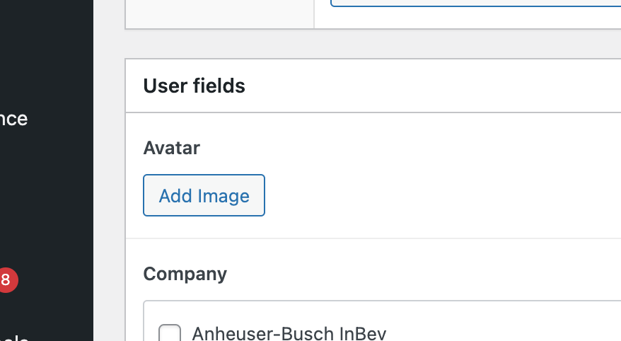
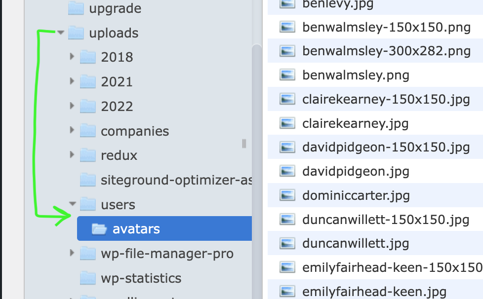

# Context ACF User Avatar

Tested up to: 5.9.1  
Tags: users, user, acf, avatar, gravatar  
Contributors: robertandrews  

## Description

* 📸 Use ACF field instead of Gravatar for user avatar.
* 🗄 Neatly store those images in a dedicated folder, with a matching filename.

### Gravatar replacement

This plugin allows site owners to let their users utilise an uploaded image as a profile avatar, instead of WordPress' default Gravatar.



### Image organisation

The uploaded images are added to the Media Library, as is normal for ACF Image uploads. There, they demand better organisation. So, the plugin performs two tasks:

1. Renames the upload file from the original to match the user's username (ie. for "John Doe", file "`My photo (1).jpg`" becomes "`johndoe.jpg`").
2. Moves this image out of the main `uploads` folder, into a dedicated avatars sub-directory of your choosing.

Together, these can reduce the size of the Media Library, and allow the site owner to manage user avatars more easily.



## Setup

### Gravatar bypass

You first need to add an Advanced Custom Fields Image field to the Edit User admin page (`user-edit.php`).

Create an ACF field group containing, at the least, a field of type Image.

In the field group settings for Location, show this group if "User Form" "is equal to" "All".

The new image uploader will appear on your Profile edit page in the Dashboard (Edit User, for your other users)).

### Avatar organisation

Beneath `/wp-content/uploads`, create a new sub-directory to house your avatar files (eg. "`/users/avatars`" for "`/wp-content/uploads/users/avatars`").

## Settings

You must then edit the plugin to add three variables:

```PHP
// Settings
$acf_field_name = 'avatar';                 // name of ACF image field storing User avatars
$acf_field_key  = 'field_6140a6da30a17';    // key of ACF image field storing User avatars
$avatars_folder = '/users/avatars';         // wp-content/uploads/{sub-folder}
```

* `$acf_field_name`: the "Field Name" you gave your ACF Image field
* `$acf_field_key`: the database key corresponding to this field. Find this most easily by using Hookturn's ACF add-on Theme Code Pro, or else by inspecting page source on the Image button.
* `$avatars_folder`: path to sub-folder of `/wp-contents/uploads` (eg. `/users/avatars`). Include leading slash but not trailing slash. (Reminder: you must already have created this folder).

## Acknowledgements

This plugin substantially leverages other people's ingenuity.

**Gravatar bypass**: Mike Hemberger's code, [ACF Pro For Local Avatars](https://thestizmedia.com/acf-pro-simple-local-avatars/), for bypassing Gravatar with an uploaded image, was written some time ago and is incorporated here.

**Image naming and organisation**: Input acknowledged from ACF support's [John Huebner](https://support.advancedcustomfields.com/forums/users/hube2/), whose help is always appreciated. Specific input occasions from John are linked in the plugin code.

## Notes

This plugin stores no database information directly.

The ACF Image field, of course, both uploads an image and sets a database binding between the image object and a User.

However, this plugin itself only bypasses Gravatar with that upload and just renames and moves the upload file.

This is my most substantive and formalised GitHub repo so far, though I am somewhat learning the ropes, etc. Please excuse faux pas.
